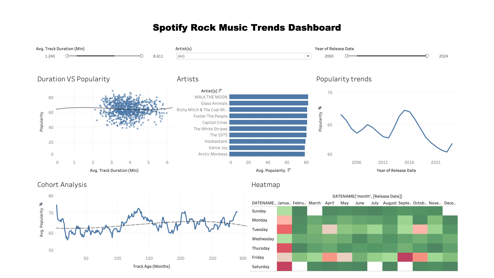

# 🎵 Spotify Rock Music Trends Analysis 🎵

## 📌 Overview
This project explores **Spotify Rock Music Trends** from **2000 to 2024** using **Tableau** for data visualization. The analysis aims to uncover key insights into rock music popularity, artist rankings, track longevity, and release patterns.

The dataset was obtained from **Spotify’s API**, cleaned using **Python (Pandas, NumPy)**, and visualized in **Tableau** to create an interactive dashboard.

## 🚀 Objectives
- Analyze **rock music popularity trends over time**.
- Identify **top artists** based on average popularity.
- Explore the **relationship between track duration and popularity**.
- Conduct a **cohort analysis** to study track longevity.
- Visualize **track release trends by month and day of the week**.

## 📊 Final Dashboard Preview
  
*(Ensure this image is in your repository under the same name, or update the path accordingly.)*

## 📂 Project Structure
